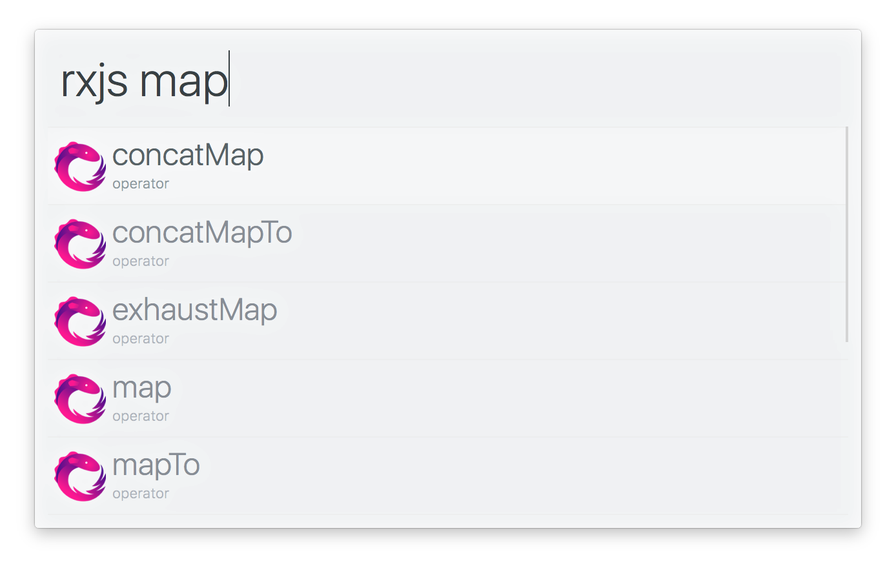

# alfred-rxjs [](https://travis-ci.org/SamVerschueren/alfred-rxjs)

> [Alfred 3](https://www.alfredapp.com/) workflow to search through the RxJS documentation




## Install

```
$ npm install -g alfred-rxjs
```

*Requires [Node.js](https://nodejs.org) 6+ and the Alfred [Powerpack](https://www.alfredapp.com/powerpack/).*


## Usage

In Alfred, type `rxjs`, <kbd>Enter</kbd>, and your query.

Select an item and press <kbd>Enter</kbd> to go to its [RxJS](http://reactivex.io/rxjs) documentation.<br>
Press <kbd>Shift</kbd> to view the documentation in Quick Look.


## Related

- [alfred-ng](https://github.com/SamVerschueren/alfred-ng) - Search through the Angular documentation on angular.io
- [alfred-ionic](https://github.com/SamVerschueren/alfred-ionic) - Search through the Ionic documentation
- [alfred-firebase](https://github.com/SamVerschueren/alfred-firebase) - Search through the Firebase documentation
- [alfred-npms](https://github.com/sindresorhus/alfred-npms) - Search for npm packages with npms.io
- [alfred-updater](https://github.com/samverschueren/alfred-updater) - Workflow updater
- [alfy](https://github.com/sindresorhus/alfy) - Create Alfred workflows with ease


## License

MIT © [Sam Verschueren](https://github.com/SamVerschueren)
